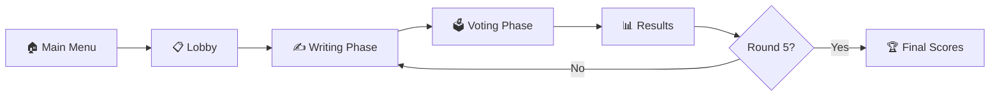

<div align="center">


<br />
<br />

# 🕵️ Who Said What?

### *A Real-Time Multiplayer Social Deduction Party Game*

<br />

[](https://react.dev/)
[](https://firebase.google.com/)
[](https://vitejs.dev/)
[](https://tailwindcss.com/)
[](https://ai.google.dev/)

<br />

[](LICENSE)
[](https://github.com/ShadowFull12/Who-Said-What/pulls)
[](https://github.com/ShadowFull12/Who-Said-What/stargazers)
[](https://github.com/ShadowFull12/Who-Said-What/network/members)

<br />

<p align="center">
  <b>Intercept mysterious conversations. Craft deceptive messages. Fool your friends.</b>
  <br />
  <sub>Think Jackbox meets Among Us — powered by AI-generated narratives.</sub>
</p>

<br />

[](#-quick-start)
&nbsp;&nbsp;
[](#-game-rules)
&nbsp;&nbsp;
[](https://github.com/ShadowFull12/Who-Said-What/issues)

<br />

---

</div>

<br />

## 🎬 How It Works

```
┌─────────────────────────────────────────────────────────────────────┐
│                                                                     │
│   👤 Agent Voss:  "We finally reached the station."                │
│                                                                     │
│   ❓ ???:         ██████████████████████████████                    │
│                                                                     │
│   👤 Dr. Kaine:  "If they find out we were here, it's over."      │
│                                                                     │
│   ─────────────────────────────────────────────                     │
│   Players write what they think the missing message is.             │
│   Then everyone votes on which one is REAL.                         │
│   Trick others → earn points. Guess right → earn more.             │
│                                                                     │
└─────────────────────────────────────────────────────────────────────┘
```

<br />

## ✨ Features

<table>
<tr>
<td width="50%">

### 🎮 Gameplay
- 🔀 **AI-Generated Conversations** — Powered by Gemini & OpenRouter
- 🕵️ **Social Deduction** — Bluff, guess, and outsmart friends
- ⏱️ **Real-Time Timers** — Timed writing & voting phases
- 🏆 **Smart Scoring** — Points for deception & detection
- 🔄 **5-Round Matches** — Full game loop with winner reveal

</td>
<td width="50%">

### 🛠️ Technical
- ⚡ **Real-Time Sync** — Firebase Realtime Database
- 👤 **Anonymous Auth** — No sign-up required
- 📱 **Fully Responsive** — Desktop, Tablet, Mobile
- 🎨 **Framer Motion** — Fluid page transitions & animations
- 🌐 **Multiplayer** — 3–10 players per room

</td>
</tr>
<tr>
<td width="50%">

### 🎨 Visual Design
- 🌌 **Futuristic Dark Theme** — Deep blue/black gradients
- 💚 **Neon Green Accents** — Glowing UI elements
- 🫧 **Glassmorphism** — Blur cards & frosted panels
- ✨ **Particle Effects** — Animated floating particles
- 🎆 **Confetti Celebrations** — Winner celebrations

</td>
<td width="50%">

### 🤖 AI Integration
- 🧠 **Gemini 2.0 Flash** — Primary conversation generator
- 🔄 **OpenRouter Fallback** — GLM-4.5 Air (free tier)
- 📝 **8 Static Fallbacks** — Works fully offline too
- 🎭 **8 Themes** — Mystery, Sci-Fi, Horror, Heist & more
- 🎯 **Smart Prompts** — Tricky but fair middle messages

</td>
</tr>
</table>

<br />

## 🏗️ Tech Stack

| Layer | Technology | Purpose |
|:------|:-----------|:--------|
| **Frontend** |  | UI Framework |
| **Bundler** |  | Lightning-fast HMR |
| **Styling** |  | Utility-first CSS |
| **Animation** |  | Page transitions & effects |
| **State** |  | Lightweight state management |
| **Backend** |  | Real-time multiplayer sync |
| **Auth** |  | Anonymous authentication |
| **AI Primary** |  | Conversation generation |
| **AI Fallback** |  | GLM-4.5 Air (free) backup |
| **Routing** |  | Client-side navigation |

<br />

## 📁 Project Structure

```
src/
├── components/
│   ├── AnimatedTitle.jsx      # Staggered neon letter animation
│   ├── BackgroundEffects.jsx  # Canvas particles, grid, noise, blur
│   ├── MessageBubble.jsx      # Chat bubbles (blue/purple/green)
│   ├── PlayerList.jsx         # Real-time player list with avatars
│   ├── Timer.jsx              # SVG circular countdown timer
│   ├── VoteCard.jsx           # Selectable vote cards with reveals
│   ├── Scoreboard.jsx         # Animated ranked scoreboard
│   ├── TypingBox.jsx          # Styled message input
│   └── BlurCard.jsx           # Glassmorphism container
├── pages/
│   ├── MainMenu.jsx           # Create / Join room
│   ├── Lobby.jsx              # Room code, player sync, start
│   ├── Game.jsx               # Conversation + writing phase
│   ├── Voting.jsx             # Vote on shuffled messages
│   ├── Results.jsx            # Round results + confetti
│   └── FinalScores.jsx        # Winner celebration
├── store/
│   └── gameStore.js           # Zustand global state
├── firebase/
│   ├── firebaseConfig.js      # Firebase initialization
│   └── firebaseService.js     # All DB operations
├── game/
│   ├── gameEngine.js          # Round lifecycle management
│   ├── geminiService.js       # AI API with 3-tier fallback
│   ├── prompts.js             # Theme-based prompt builder
│   └── scoring.js             # Points calculation
├── styles/
│   └── globals.css            # Tailwind + custom utilities
├── App.jsx                    # Router + toast config
└── main.jsx                   # React entry point
```

<br />

## 🚀 Quick Start

### Prerequisites

| Tool | Version |
|:-----|:--------|
| **Node.js** | `≥ 18.x` |
| **npm** | `≥ 9.x` |
| **Firebase Project** | With Realtime Database enabled |
| **Gemini API Key** | From [Google AI Studio](https://aistudio.google.com/) |

### Installation

```bash
# Clone the repository
git clone https://github.com/ShadowFull12/Who-Said-What.git

# Navigate to project
cd Who-Said-What

# Install dependencies
npm install
```

### Environment Setup

Create a `.env` file in the root directory:

```env
VITE_FIREBASE_API_KEY=your_firebase_api_key
VITE_FIREBASE_AUTH_DOMAIN=your_project.firebaseapp.com
VITE_FIREBASE_PROJECT_ID=your_project_id
VITE_FIREBASE_STORAGE_BUCKET=your_project.firebasestorage.app
VITE_FIREBASE_MESSAGING_SENDER_ID=your_sender_id
VITE_FIREBASE_APP_ID=your_app_id
VITE_FIREBASE_DATABASE_URL=https://your_project-default-rtdb.firebaseio.com
VITE_GEMINI_API_KEY=your_gemini_api_key
VITE_OPENROUTER_API_KEY=your_openrouter_api_key
```

### Launch

```bash
# Start development server
npm run dev
```

> 🌐 Opens at **http://localhost:3000**

<br />

## 🎮 Game Rules

### Flow



### Phases

| # | Phase | Duration | Description |
|:--|:------|:---------|:------------|
| 1 | **Lobby** | — | Host creates room, players join via 5-char code |
| 2 | **Writing** | 25 sec | Players write a fake "missing message" |
| 3 | **Voting** | 20 sec | Everyone votes on which message is real |
| 4 | **Results** | — | Reveal who fooled who |
| 5 | **Final** | — | Winner celebration after 5 rounds |

### Scoring

| Action | Points |
|:-------|-------:|
| 🎭 Fool a player with your fake message | **+100** per player fooled |
| 🎯 Correctly guess the real message | **+150** |
| 🔥 Nobody guesses the real message (bonus to all fakers) | **+50** |

<br />

## 🎨 Theme & Design

<table>
<tr>
<td align="center"><strong>Background</strong></td>
<td align="center"><strong>Primary</strong></td>
<td align="center"><strong>Accent</strong></td>
<td align="center"><strong>Accent 2</strong></td>
</tr>
<tr>
<td align="center"><br/><code>#000814</code></td>
<td align="center"><br/><code>#00ff88</code></td>
<td align="center"><br/><code>#00d4ff</code></td>
<td align="center"><br/><code>#6366f1</code></td>
</tr>
</table>

| Element | Style |
|:--------|:------|
| **Typography** | Space Grotesk (headings) + Inter (body) |
| **Cards** | Glassmorphism with `backdrop-blur` |
| **Buttons** | Neon glow on hover + scale animation |
| **Particles** | Canvas-rendered floating glow dots |
| **Grid** | Subtle animated background grid |
| **Confetti** | Canvas-confetti on wins |

<br />

## 🤖 AI Conversation Themes

The AI generates dramatic conversations across **8 themes**:

| Theme | Vibe |
|:------|:-----|
| 🕵️ Mystery | Whodunit tension |
| 🕶️ Spy Thriller | Covert operations |
| 🚀 Sci-Fi | Space & technology |
| 💰 Heist | High-stakes robbery |
| 👻 Horror | Creepy encounters |
| 🌍 Post-Apocalyptic | Survival scenarios |
| 🎩 Noir Detective | Dark investigations |
| ⚔️ Fantasy Quest | Epic adventures |

<br />

## 🔥 Firebase Database Structure

```
rooms/
└── {ROOM_CODE}/
    ├── host: "userId"
    ├── createdAt: timestamp
    ├── gameState/
    │   ├── phase: "lobby" | "writing" | "voting" | "results" | "finalScores"
    │   ├── round: 1-5
    │   └── timerEnd: timestamp
    ├── players/
    │   └── {userId}/
    │       ├── name: "PlayerName"
    │       ├── color: "#hex"
    │       ├── isHost: boolean
    │       └── connected: boolean
    ├── conversations/
    │   └── {round}/
    ├── messages/
    │   └── {round}/{userId}/
    ├── votes/
    │   └── {round}/{userId}/
    ├── shuffledOptions/
    │   └── {round}/
    ├── roundResults/
    │   └── {round}/
    └── scores/
        └── {userId}: number
```

<br />

## 🛡️ AI Fallback Chain

```
┌──────────────────┐     ┌──────────────────┐     ┌──────────────────┐
│  Gemini 2.0 Flash│ ──▶ │  OpenRouter       │ ──▶ │  Static Fallback │
│  (Primary)       │     │  GLM-4.5 Air Free │     │  8 Conversations │
└──────────────────┘     └──────────────────┘     └──────────────────┘
        ❌ fail                  ❌ fail                  ✅ always works
```

> The game **always works** — even without API keys, thanks to built-in fallback conversations.

<br />

## 📜 Scripts

| Command | Description |
|:--------|:------------|
| `npm run dev` | Start development server |
| `npm run build` | Build for production |
| `npm run preview` | Preview production build |

<br />

## 🤝 Contributing

Contributions are welcome! Here's how:

1. **Fork** the repository
2. **Create** a feature branch (`git checkout -b feature/amazing-feature`)
3. **Commit** your changes (`git commit -m 'Add amazing feature'`)
4. **Push** to the branch (`git push origin feature/amazing-feature`)
5. **Open** a Pull Request

<br />

## 📄 License

This project is licensed under the **MIT License** — see the [LICENSE](LICENSE) file for details.

<br />

---

<div align="center">

<br />

**Built with ❤️ and a lot of ☕**

<br />

[](https://github.com/ShadowFull12)

<sub>If you enjoyed this project, consider giving it a ⭐</sub>

</div>
